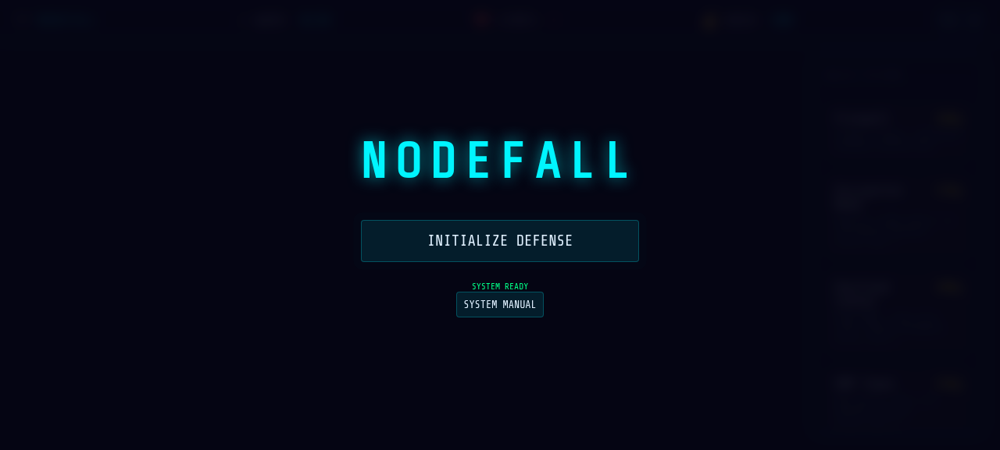

# NODEFALL | Network Defense Simulator



A cyberpunk-themed tower defense game built with **Three.js + TypeScript + Vite**. Defend the Core Server from corrupted data packets for 20 waves across multiple network maps.

## 🎮 Quick Start

```bash
cd nodefall
npm install
npm run dev
```

Then open `http://localhost:5173` in your browser.

## 🎯 Objectives

- **Defend** the Core Server from corrupted data packets
- **Survive** 20 waves of increasingly dangerous threats
- **Build** and **upgrade** defensive towers along the data path
- **Boss waves** every 5th wave feature a massive Kernel Boss

## 🕹️ Controls

| Key | Action |
|-----|--------|
| **Left Click** | Place tower / Select tower |
| **1-5** | Quick-select towers by number |
| **E** / **ESC** | Cancel placement |
| **Space** | Toggle pause |
| **Speed button** | Cycle 1x, 2x, 3x game speed |

## 🏗️ Tower Types (Progressive Unlock)

New towers unlock as you progress through waves:

| Key | Tower | Cost | Unlocks | Description |
|-----|-------|------|---------|-------------|
| **1** | Firewall | 100g | Wave 1 | Single target, balanced protection |
| **2** | Encryption Node | 150g | Wave 4 | Applies SLOW effect to enemies |
| **3** | Overload Cannon | 200g | Wave 8 | High DMG, slow fire rate |
| **4** | EMP Tower | 250g | Wave 12 | AoE burst, hits all nearby threats |
| **5** | Ice Node | 175g | Wave 16 | Applies FREEZE effect briefly |

## 🗺️ Map Progression

The network map changes every 5 waves:
- **Waves 1-5**: Simple snake path
- **Waves 6-10**: Zigzag layout
- **Waves 11-15**: Loop-de-loop
- **Waves 16-20**: Spiral

Each map change refunds 80% of tower costs + bonus gold, then pauses for 3 seconds to let you rebuild.

## 👾 Enemy Types

| Enemy | Description |
|-------|-------------|
| **Data Packet** | Basic corrupted data, low HP |
| **Worm Process** | Splits into two smaller units when killed |
| **Daemon Thread** | High HP, slow moving |
| **Rootkit** | Fast, medium HP |
| **Kernel Boss** | Massive boss, appears every 5 waves |

## 🛠️ Tech Stack

- **Engine**: Three.js (3D rendering)
- **Language**: TypeScript
- **Build Tool**: Vite
- **Architecture**: Component-based ECS pattern

## 📝 Development

```bash
npm run dev      # Start dev server
npm run build    # Production build
npm run preview  # Preview build
```

## 👥 Credits

**Course**: Programming 2

**Developers**: Jae + Teammates
